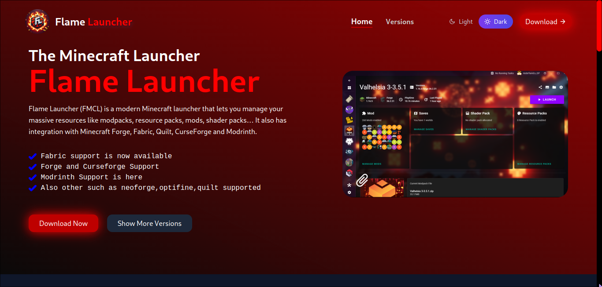

# Flamelauncher Website

This README file provides a minimal setup to get React working in Vite with Hot Module Replacement (HMR) and some ESLint rules.

## Overview

Flamelauncher is a modern web application designed to provide users with an intuitive and efficient way to manage their projects. Built with React and Vite, it leverages the latest web technologies to ensure a fast and responsive user experience. The application includes features such as real-time updates, customizable project dashboards, and seamless integration with various third-party services.

Key features of Flamelauncher:
- **Real-time Collaboration**: Work with your team in real-time with instant updates and notifications.
- **Customizable Dashboards**: Tailor your project views to suit your workflow and preferences.
- **Third-party Integrations**: Connect with popular services like GitHub, Slack, and Trello to streamline your project management.
- **Responsive Design**: Access your projects from any device with a responsive and mobile-friendly interface.

Whether you are managing a small team or a large organization, Flamelauncher provides the tools you need to stay organized and productive.
## Screenshots

Here are some screenshots of Flamelauncher Website in action:

### Front Page


### Features Page


### Version Page


### Download Page


## Getting Started

To get started with this template, follow these steps:

1. Clone the repository:
    ```sh
    git clone https://github.com/theflames-presence/flamelauncher-website.git
    ```

2. Install dependencies:
    ```sh
    cd flamelauncher-website
    npm install
    ```

3. Start the development server:
    ```sh
    npm run dev
    ```
